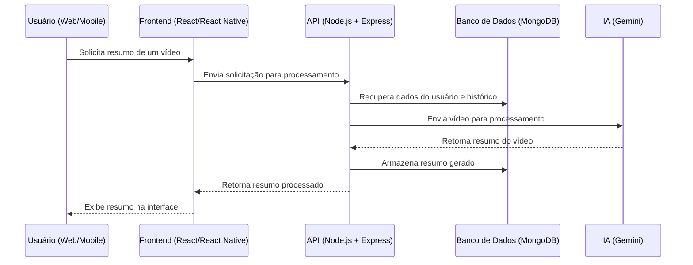

# Documentação da Arquitetura Distribuída

## Visão Geral

O projeto segue uma arquitetura distribuída baseada em microsserviços, utilizando tecnologias modernas para garantir escalabilidade, segurança e alta disponibilidade. A solução será composta por uma aplicação web e mobile, além de uma API centralizada para comunicação entre os serviços.

## Tecnologias Utilizadas

- **Frontend Web**: React.js
- **Aplicativo Mobile**: React Native
- **Backend**: Node.js com Express
- **Banco de Dados**: MongoDB com Prisma ORM
- **IA Integrada**: Integração com o Gemini
- **Autenticação**: JWT para autenticação de usuários
- **Hospedagem e Deploy**:
  - Frontend: GitHup pages
  - Backend: AWS EC2 / Render
  - Banco de Dados: MongoDB Atlas

## Arquitetura do Sistema

O sistema é dividido em diferentes camadas:

- **Camada de Apresentação** (Frontend Web e Mobile)

  - Responsável pela interface do usuário e interações.
  - Consome os serviços expostos pelo backend via API REST.

- **Camada de Serviços** (Backend)

  - API construída com Node.js e Express.
  - Comunicação com o banco de dados MongoDB via Prisma ORM.
  - Integração com o modelo de IA Gemini para processamento de dados.

- **Camada de Dados**
  - Banco de dados MongoDB armazenando informações de usuários, vídeos e resumos.

## Fluxo de Comunicação

## Componentes do Sistema

1. **Frontend Web e Mobile**

   - Desenvolvido em React e React Native.
   - Comunicação com backend via API REST.
   - Interface intuitiva para upload e consulta de resumos.

2. **Backend (API)**

   - Desenvolvido em Node.js com Express.
   - Gestão de usuários, vídeos e integração com a IA Gemini.
   - Implementação de segurança via JWT.

3. **Banco de Dados**

   - MongoDB gerenciado pelo MongoDB Atlas.
   - Prisma ORM para manipulação eficiente dos dados.

4. **Integração com IA (Gemini)**
   - Envio de vídeos para processamento de resumos.
   - Retorno de textos otimizados para exibição aos usuários.

## Segurança e Escalabilidade

- **Autenticação e Autorização**: Implementação de JWT para segurança das requisições.
- **Escalabilidade**: Uso de serviços na nuvem (AWS, Vercel, MongoDB Atlas) para garantir disponibilidade e desempenho.
- **Monitoramento**: Logs e métricas via ferramentas como LogRocket e AWS CloudWatch.

## Conclusão

Essa arquitetura foi planejada para garantir alta performance, facilidade de manutenção e uma boa experiência para o usuário. Com a integração de IA, os resumos serão gerados de forma eficiente, proporcionando um serviço inovador e acessível.
